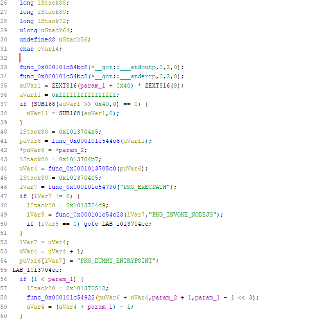

# YACM

We get an executable file `yacm`, which a `Mach-O 64-bit x86_64` executable.

After running `strings` we see a lot of JS (🤮) code.

We can easily open it in Ghidra to see what's inside. Here's a sample from `entry`:


"PKG_..." strings and the JS code inside hint us that the binary is packaged using `vercel/pkg`.

We can easily unpack it with the help of https://github.com/LockBlock-dev/pkg-unpacker

verify_flag.js
```js
const readline = require('readline');
const Brainfuck = require('brainfuck-node');
const brainfuck = new Brainfuck({maxSteps: 5000000});

const prog = ">>>>+++++++++.....";

const rl = readline.createInterface(process.stdin, process.stdout);

rl.question('Enter flag: ', (flag) => {
    let result = brainfuck.execute(prog, flag);
    console.log(result.output.split(': ', 2)[1].trim());
    rl.close();
});
```

It's a flag checker in brainfuck!

My initial idea was to use angr - with the bf platform https://github.com/angr/angr-platforms/tree/master/angr_platforms/bf - but I couldn't make it work.

After running the code, we can see that it prints `not ok` after first occurrence of invalid character in the flag - that means we can simply brute force it :) - a bit slow but why not

I did it by copying a brainfuck interpreter in python and replacing `getch` function, then counting how many times `getch` was called to find correct characters.

solve.py
```py
import string

def evaluate(code, getch):
  code     = cleanup(list(code))
  bracemap = buildbracemap(code)

  output = ''
  cells, codeptr, cellptr = [0], 0, 0

  while codeptr < len(code):
    command = code[codeptr]

    if command == ">":
      cellptr += 1
      if cellptr == len(cells): cells.append(0)

    if command == "<":
      cellptr = 0 if cellptr <= 0 else cellptr - 1

    if command == "+":
      cells[cellptr] = cells[cellptr] + 1 if cells[cellptr] < 255 else 0

    if command == "-":
      cells[cellptr] = cells[cellptr] - 1 if cells[cellptr] > 0 else 255

    if command == "[" and cells[cellptr] == 0: codeptr = bracemap[codeptr]
    if command == "]" and cells[cellptr] != 0: codeptr = bracemap[codeptr]
    if command == ".": output += chr(cells[cellptr])
    if command == ",": cells[cellptr] = ord(getch())
      
    codeptr += 1

  return output


def cleanup(code):
  return ''.join(filter(lambda x: x in ['.', ',', '[', ']', '<', '>', '+', '-'], code))


def buildbracemap(code):
  temp_bracestack, bracemap = [], {}

  for position, command in enumerate(code):
    if command == "[": temp_bracestack.append(position)
    if command == "]":
      start = temp_bracestack.pop()
      bracemap[start] = position
      bracemap[position] = start
  return bracemap

i = 0

def generate_getch(flag):
  global i
  i = 0
  def getch():
    global i
    i += 1
    return flag[i-1]
  return getch


alphabet = string.ascii_letters + string.digits + '_-}'

def main():
  global i

  with open('code.bf') as f:
    code = f.read()

  flag = 'ecsc23{'

  while True:
    for c in alphabet:
      getch = generate_getch(flag + c + ' ')
      res = evaluate(code, getch)

      if 'not ok' not in res:
        print(flag)
        exit()

      if i > len(flag+c):
        flag += c
        print(flag)
        break

main()
```